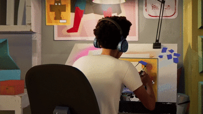

# Hi👋🏾 I’m Gabriel and I’m a Software Engineer!

<table border="2" cellspacing="0" cellpadding="0">
  <tr>
    <td style="border: 0";>
      

        <picture>
           
        <picture>
      

    </td>
    <td style="border: 0" width="50%">
      <h3>About the human behind the codes:</h3>
      <ul>
        <li>
          🌎 I'm a 25 years old brazilian developer from São Paulo.
        </li>
        <li>
          💜 But I'm also a music, art, video games and sports lover.
        </li>
        <li>
          ☕ I'm powered by music (and some hot coffee too).
        </li>
        <li>
          💛 And I trully love my family and my pets! :)
        </li>
        <li>
          📧 <a href=mailto:gabriel.rodriguesxs@gmail.com>Contact me via e-mail</a>
        </li>
      </ul>
    </td>
  </tr>
</table>

<h2>Tech Stack</h2>
<table width="100%">
  <tr>
    
  <td valign="top" width="50%">
  <h3>Backend</h3>
  
  
  
  <h3>Frontend</h3>
  
  
  </td>
  
  <td valign="top" width="50%">
  <h3>Databases</h3>
  
  
  
  <h3>Cloud & DevOps</h3>
  
  
  </td>
  
  </tr>
</table>

<h2 align="left">Stats</h2>

  
  

<!-- Layout made with <3 by github.com/gabzoom -->
